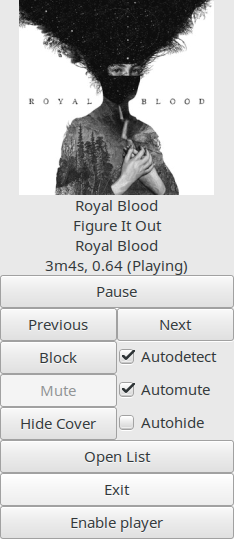

# blockify

**Important**: This application is no longer being maintained. Please note that using ad blockers is prohibited by Spotify. I highly encourage everyone to support Spotify and your favorite artists by buying a subscription.  

Blockify is a linux only application that allows you to automatically mute songs and advertisements in Spotify.


## Installation

### Dependencies

Mandatory:
  - Python3
  - Spotify > 1.0.12 (to get the latest version follow the instructions given here [Spotify-Client-1-x-beta-] (https://community.spotify.com/t5/Spotify-Community-Blog/Spotify-Client-1-x-beta-for-Linux-has-been-released/ba-p/1147084))
  - wmctrl (provides information about the Spotify window)
  - alsa-utils
  - PyGObject 3
  - GTK+ 3

Optional but highly recommended:
  - Pulseaudio (allows muting Spotify instead of all system sound)
  - Gstreamer1.0 (used to play music of your choice during muted ads. Requires pulseaudio.)

Optional:
  - docopt (provides a command-line interface for blockify and blockify-ui)

On ArchLinux, you can install all dependencies as follows:  
`pacman -S git python-pip gst-python pulseaudio alsa-utils pygtk python-dbus python-gobject python-docopt wmctrl`

### Package Manager

#### Arch Linux

Available via AUR here: https://aur.archlinux.org/packages/?O=0&K=blockify

Example ArchLinux installation routine:  
``` bash
git clone https://aur.archlinux.org/blockify.git
cd blockify
makepkg -sri
```

#### Fedora and openSUSE

Available in the [openSUSE build service](https://build.opensuse.org/package/show/home:fusion809/blockify).

#### Debian

```bash
sudo apt-get install gir1.2-gstreamer-0.10 gir1.2-gstreamer-1.0 python-gst-1.0
sudo apt-get install libdbus-1-dev libdbus-glib-1-dev
sudo pip3 install dbus-python
sudo pip3 install git+https://github.com/serialoverflow/blockify
```

### Manual (pip/setup.py)

If there is no blockify package available on your distribution, you'll have to install it directly via one of pythons many installation tools.  


Package names are for ArchLinux and will probably differ slightly between distributions.

Preparation (for Ubuntu):  
```bash
# Install Spotify beta
echo deb http://repository.spotify.com testing non-free | sudo tee /etc/apt/sources.list.d/spotify.list
sudo apt-get update
sudo apt-get install spotify-client
# Install blockify dependencies
sudo apt-get install git python3-pip python3-gst-1.0 python3-requests python3-docopt python3-setuptools wmctrl
```

Install routine:  
```bash
# Install blockify
sudo pip3 install git+https://github.com/serialoverflow/blockify
echo -e '[Desktop Entry]\nName=Blockify\nComment=Blocks Spotify commercials\nExec=blockify-ui\nIcon='$(python3 -c 'import pkg_resources; print(pkg_resources.resource_filename("blockify", "data/icon-red-512.png"))')'\nType=Application\nCategories=AudioVideo' | sudo tee /usr/share/applications/blockify.desktop
```

## Usage

### Requirements

It is important to know that blockify relies on dbus (and, for some features, on pulseaudio) for ad detection.  
If any of these statements are true for your configuration, ad detection will _not_ work:  
* DBus is disabled
* Spotify is minimized to the system tray (task bar is fine)
* Notifications are disabled in Spotify  

Additionally, blockify makes use of pulseaudio sinks, allowing processes to be muted individually.    
If you do not have/want pulseaudio, blockify will mute the system sound during commercials instead of just Spotify. The interlude music feature will not work as a consequence.

### Detection

Blockify will automatically detect and block ads for you so besides starting it after running spotify, there's not a lot to do.  
However, it also comes with the option to complement or replace that autoblock functionality with a blocklist (saved as ~/.config/blockify/blocklist.txt).  
Blocklist entries are case-sensitive and greedy, e.g. the entry `Blood` would match any artist starting with those exact five letters.    

### Controls/Actions

Blockify accepts several signals:
* SIGINT(9)/SIGTERM(15): Exit cleanly.
* SIGUSR1(10): Block current song.
* SIGUSR2(12): Unblock current song.
* SIGRTMIN(34): Play previous spotify song.
* SIGRTMIN+1(35): Play next spotify song.
* SIGRTMIN+2(36): Toggle play/pause the current spotify song.
* SIGRTMIN+3(37): Toggle block state of current song.
* SIGRTMIN+10(44): Play previous interlude song.
* SIGRTMIN+11(45): Play next interlude song.
* SIGRTMIN+12(46): Toggle play/pause the current interlude song.
* SIGRTMIN+13(47): Toggle interlude autoresume.

To easily use these signals add the following function to your .bashrc:
```bash
bb() {
    local signal
    case "$1" in
        '')  blockify-dbus get 2>/dev/null && return 0;;
        ex|exit)
            signal='TERM';;       # Exit
        b|block)
            signal='USR1';;       # Block
        u|unblock)
            signal='USR2';;       # Unblock
        p|previous)
            signal='RTMIN';;      # Previous song
        n|next)
            signal='RTMIN+1';;    # Next song
        t|toggle)
            signal='RTMIN+2';;    # Toggle play song
        tb|toggleblock)
            signal='RTMIN+3';;    # Toggle block song
        ip|iprevious)
            signal='RTMIN+10';;   # Previous interlude song
        in|inext)
            signal='RTMIN+11';;   # Next interlude song
        it|itoggle)
            signal='RTMIN+12';;   # Toggle play interlude song
        itr|itoggleresume)
            signal='RTMIN+13';;   # Toggle interlude resume
        *) echo "Usage: bb ( b[lock] | u[nblock] | p[revious] | n[ext] | t[oggle] | t[oggle]b[lock] |...)" && return 0;;
    esac
    pkill --signal "$signal" -f 'python.*blockify'
}
```
Then use it via e.g. `bb` to get current song info or `bb t` to toggle playback.

#### CLI

Blockify has a CLI/daemon that you can start with `blockify`.  
`blockify -h` will print out a help text with available options.  

##### GUI

Alternatively, you can use the GUI with `blockify-ui` which spawns this window.  

- Play, Previous, Next: These buttons use dbus to send audio control commands to spotify.
- Block/Unblock: Add/Remove the currently playing song to/from the blocklist.
- Mute/Unmute: Mute/Unmute the current song. Only works if "Manual" checkbox is activated.
- Mute (manual): Disables automatic mute of ads and instead allows you to mute manually.
- Show/Hide Cover: Enable/Disable display of cover art image.
- Autodetect: Let blockify automatically detect ads or switch to manual blocklist-style.
- Automute: Let blockify automatically handle mute or switch to manual muting.
- Autohide: If this option is checked, the cover art will be automatically hidden whenever a commercial is playing.
- Open/Close List: Opens a small popup text editor with the blocklist opened where you can edit and save it. Keybinds: Control-S (save), Control-W/Q (close), Control-D (delete current line).
- Exit: Stop blockify cleanly, i.e. unmute sinks, update blocklist and generally clean up.
- Enable/disable Player: Shows and enables resp. hides and disables the mini audio player (interlude player) below the button which will play music instead of commercials.
- Prev, Play/Pause, Next (bottom): Media buttons to control the interlude player.
- Browse: Allows you to open m3u-playlists and/or audio files on the fly. You can select multiple items and combine playlists with audio files. The player will automatically load those and discard the previous playlist.  
- Autoresume: If enabled, the interlude player will switch back to Spotify as soon as the commercials end. If disabled, the current interlude song will be finished before switching back to Spotify.  

#### Configuration

Please see the provided [example_blockify.ini](https://github.com/serialoverflow/blockify/blob/master/blockify/data/example_blockify.ini) on what settings are available and their purpose.  
Blockify automatically creates a configuration file at `$HOME/.config/blockify/blockify.ini` if you don't have one already. It will also tell you via ERROR-logging messages, if you configuration file is faulty or incomplete, in which case the options that could be read will be merged with the default options you see in example_blockify.ini but you'll still want to fix your configuration file.  

#### Interlude Music

From version 1.4 onwards blockify can play music of your choice during commercial breaks.  
The default behaviour is for blockify to automatically play the first song in the playlist file (should you have one), when a commercial starts playing.  
Alternatively, you can set the autoresume option to False which will cause blockify to always finish the current interlude song before resuming spotify playback.   

The interlude feature only works if you use pulseaudio (i.e. spotify needs to run in its own sink so it can be muted separately).    
To make use of interlude music you have to configure a playlist file in `~/.config/blockify/playlist.m3u`.  
The playlist system is (mostly) M3U-compliant.  

An example playlist:
```
# Lines starting with "#" will be ignored.
# Absolute path to a file:
/media/music/foo/bar.mp3
# Relative path to a file (as seen from playlist location):
foo/bar.flac
# Relative path to another playlist. Just make sure the other playlist doesn't link back or else you'll get a very long playlist:
baz.m3u
# A whole directory:
/media/music/foo
# It's also possible to give full URIs:
file:///media/music/foo/bar.mp4
http://www.example.com/foo/bar.wav
# A radio station. Note that radio streams don't usually end so you'll have to switch
# back to spotify manually, enable autoresume or specify the radio_timeout in the config file.
http://skyserver5.skydisc.net:8000
```
You can use relative and absolute paths as well as basically any audio source/format, as long as you have the respective gstreamer codec installed. 


## Troubleshooting

### Known issues

- If Spotify is minimized to the system tray, ad detection will not work.
- If DBus/Notifications are disabled, ad detection will not work.

### Common issues

* `ImportError: No module named gst`: You need to install gst-python.
* Interlude music not playing: You might need to install gstreamer codecs (-bad, -ugly, ...).  
* Configuration is not loaded properly: Syntax might have changed between blockify versions. If in doubt, delete your configuration file. It will be rewritten with current defaults.  

### Debugging

If you can't find or fix the issue you are having by yourself, you are welcome to open an issue on this site. When you do, **please** provide the following information:
- A debug log, acquired by starting blockify(-ui) via `blockify(-ui) -vvv -l logfile`. Then upload it with `curl -F "c=logfile" https://ptpbw.pw` or paste it to a gist or bpaste.net or directly into the git issue (preferably with code tags -> three backticks before and after the snippet).
- The blockify version: `blockify --version`.
- If you suspect pulseaudio as culprit, the list of sinks: `pacmd list-sink-inputs | curl -F c=@- https://ptpb.pw`.


## Similar open-source projects

### On Linux:

- [Spotify-AdKiller](https://github.com/SecUpwN/Spotify-AdKiller) - automatic ad-blocker written in Bash

### On Windows:

- [Spotify-Ad-Blocker](https://github.com/Xeroday/Spotify-Ad-Blocker)

### On OS X:

- [SpotiFree](https://github.com/ArtemGordinsky/SpotiFree)

